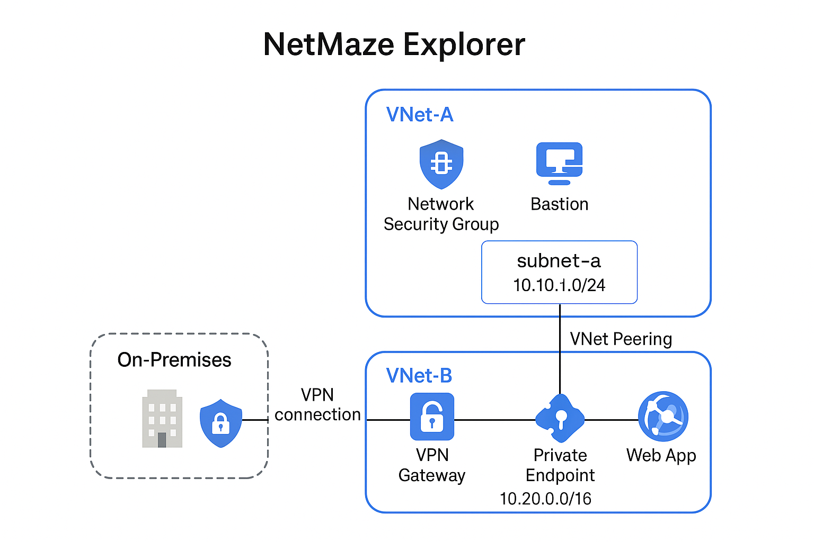

---
tags:
  - cert/az-104
  - project/netmaze-explorer
  - topic/virtual-network
  - topic/vnet-peering
  - topic/nsg
  - topic/bastion
  - topic/vpn-gateway
  - topic/private-endpoint
  - topic/app-service
---

# 🌐 NetMaze Explorer – Hybrid Networking on Azure

**NetMaze Explorer** is a practical Azure networking lab project designed to simulate a hybrid cloud environment. It walks through building secure connectivity between on-premises infrastructure and Azure resources using Virtual Networks, Bastion, NSGs, VPN Gateway, and Private Endpoints.



---

## 📌 Project Goals

- Build and connect multiple Azure VNets
- Configure secure access using Bastion and NSGs
- Simulate on-premise connectivity with a VPN Gateway and Local Network Gateway
- Host an internal web application via Private Endpoint
- Practice key **AZ-104** networking concepts

---

## 🧱 Architecture Components

| Component             | Description |
|----------------------|-------------|
| VNet-A               | Main VNet for admin access and Bastion |
| VNet-B               | Application VNet hosting VPN Gateway and Web App |
| Network Peering      | Enables internal traffic between VNets |
| NSG                  | Restricts access to specific subnets |
| Bastion              | Secure RDP/SSH without public IPs |
| VPN Gateway          | Establishes Site-to-Site connection with on-prem |
| Private Endpoint     | Provides internal-only access to Web App |
| App Service          | Hosts internal web application |

---

## ⚙️ Deployment Steps

Each phase is documented in Obsidian-compatible markdown files:

1. `1.0_Create_Resource_Group_and_VNet.md`  
2. `2.0_VNet_Peering.md`  
3. `3.0_NSG_and_Bastion.md`  
4. `4.0_VPN_Gateway_Setup.md`  
5. `5.0_Private_Endpoint_WebApp.md`

---

## ✅ Prerequisites

- Azure subscription
- Basic Azure CLI or Portal knowledge
- [AZ-104](https://learn.microsoft.com/en-us/certifications/exams/az-104/) study focus

---

## 📁 File Structure

```
📦NetMazeExplorer
 ┣ 📄 README.md
 ┣ 📄 1.0_Create_Resource_Group_and_VNet.md
 ┣ 📄 2.0_VNet_Peering.md
 ┣ 📄 3.0_NSG_and_Bastion.md
 ┣ 📄 4.0_VPN_Gateway_Setup.md
 ┣ 📄 5.0_Private_Endpoint_WebApp.md
 ┗ 📷 A_network_architecture_diagram_titled_"NetMaze_Exp.png"
```

---

## 🧠 Learning Outcomes

- Deep understanding of Azure VNet architecture
- Hands-on with secure access strategies
- Site-to-site VPN configuration with simulated on-prem setup
- Private Link and endpoint integration for internal-only services

